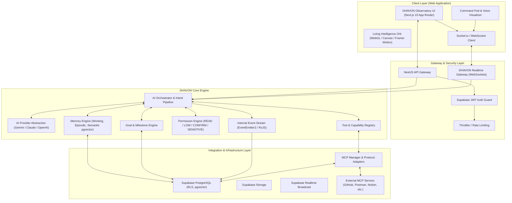
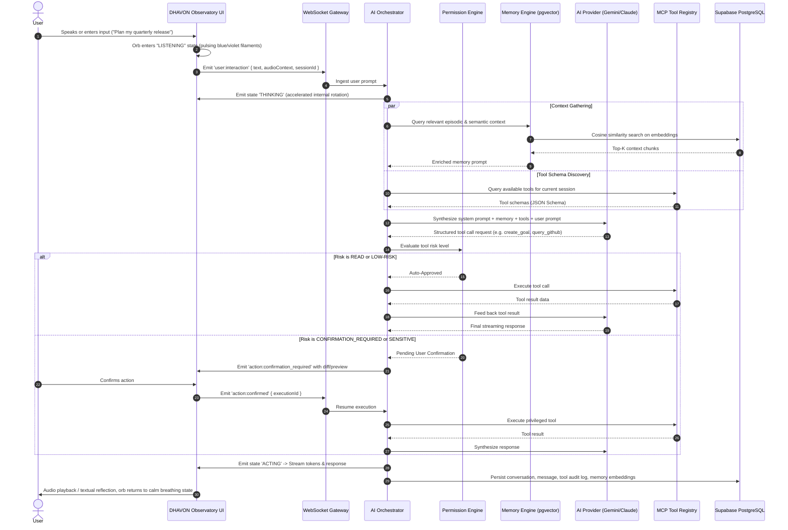

# DHAVON — System Architecture Specification
**Personal AI Operating System**
*Lead Architect & Senior Full-Stack Engineering Blueprint*

---

## 1. Executive Summary & Vision

DHAVON is not another conversational wrapper, chatbot widget, or SaaS dashboard. It is an **Autonomous Personal Intelligence Operating System (AI OS)** designed to act as a lifelong cognitive partner for its user.

The system is architected around three foundational pillars:
1. **Atmospheric Presence**: A distraction-free, cinematic "Observatory" interface centered on the living intelligence orb of DHAVON rather than cluttered panels or generic sidebar layouts.
2. **Deterministic Core Orchestration**: A structured cognitive core (Goals, Tasks, Working/Episodic Memory, Permissions, Tool Sandboxing) that separates business logic and agentic autonomy from ephemeral UI states.
3. **Open Extensibility via MCP**: A native Model Context Protocol (MCP) integration layer connecting DHAVON dynamically to external tools (GitHub, Supabase, Postman, Google Workspace, Notion) without tight coupling.

---

## 2. High-Level System Architecture



---

## 3. Monorepo Repository Structure

The project is structured as a clean, modular monorepo supporting strict boundaries, shared packages, and independent scalability.

```
DHAVON/
├── apps/
│   ├── web/                          # Next.js 15+ App Router application
│   │   ├── src/
│   │   │   ├── app/                  # App Router pages, layout, route handlers
│   │   │   ├── components/           # Observatory components (Orb, HUD, CommandPod)
│   │   │   │   ├── observatory/      # Core Observatory visual environment
│   │   │   │   │   ├── IntelligenceOrb.tsx
│   │   │   │   │   ├── ObservatoryBackdrop.tsx
│   │   │   │   │   ├── ReflectivePlinth.tsx
│   │   │   │   │   ├── AtmosphereParticles.tsx
│   │   │   │   │   └── ObservatoryHeader.tsx
│   │   │   │   ├── controls/         # Command & Voice interaction
│   │   │   │   │   ├── CommandPod.tsx
│   │   │   │   │   ├── VoiceVisualizer.tsx
│   │   │   │   │   └── QuickActionPill.tsx
│   │   │   │   └── ui/               # Reusable atomic UI primitives
│   │   │   ├── hooks/                # React hooks (useVoiceInput, useOrbState, useWebSocket)
│   │   │   ├── stores/               # Client state management (Zustand)
│   │   │   ├── styles/               # Global CSS, Tailwind custom utilities
│   │   │   └── lib/                  # Frontend utilities, Supabase client
│   │   ├── public/                   # Static assets, branding, audio assets
│   │   ├── package.json
│   │   ├── tailwind.config.ts
│   │   └── tsconfig.json
│   │
│   └── api/                          # NestJS 10+ backend service
│       ├── src/
│       │   ├── app.module.ts         # Root module
│       │   ├── main.ts               # Entrypoint & bootstrap
│       │   ├── core/                 # DHAVON Core engine modules
│       │   │   ├── orchestrator/     # AI cognitive loop & pipeline
│       │   │   ├── memory/           # Memory retrieval, storage & embeddings
│       │   │   ├── goals/            # Goal decomposition & task management
│       │   │   ├── permissions/      # Risk classification & approval flow
│       │   │   ├── tools/            # Tool definitions & sandbox execution
│       │   │   └── events/           # Audit logging & system telemetry
│       │   ├── providers/            # AI Provider adapters (Gemini, Anthropic, OpenAI)
│       │   ├── mcp/                  # MCP client manager & transport adapters
│       │   ├── database/             # Supabase client, repositories, RLS context
│       │   ├── gateway/              # WebSocket & REST API controllers
│       │   └── common/               # Guards, interceptors, filters, decorators
│       ├── package.json
│       └── tsconfig.json
│
├── packages/
│   ├── ui/                           # Shared design tokens, color palette, animations
│   ├── types/                        # Shared TypeScript interfaces, DTOs, domain models
│   └── mcp/                          # Shared MCP interfaces, schemas, protocol helpers
│
├── supabase/
│   ├── migrations/                   # Sequential SQL migrations (DDL, RLS, functions)
│   └── seed/                         # Initial database seed (system settings, user seed)
│
├── docker/
│   ├── docker-compose.yml            # Local development orchestration
│   ├── Dockerfile.web                # Production container for Next.js
│   └── Dockerfile.api                # Production container for NestJS
│
├── tests/
│   ├── postman/                      # Postman collections & environment definitions
│   └── e2e/                          # End-to-end integration test suites
│
├── docs/                             # Deep-dive architecture and design specs
├── package.json                      # Monorepo root package.json (pnpm workspaces)
├── pnpm-workspace.yaml               # Workspace configuration
└── tsconfig.base.json                # Base TypeScript configuration
```

---

## 4. End-to-End Interaction Lifecycle

When the user interacts with DHAVON via voice or text:



---

## 5. Security & Trust Architecture

1. **Zero Secret Leakage**:
   - `apps/web` has access **only** to public, anon Supabase keys and public environment flags (`NEXT_PUBLIC_*`).
   - All external API keys (LLM providers, Supabase service-role, MCP connection secrets) reside strictly in `apps/api`.
2. **Four-Tier Permission Model**:
   - `READ`: Safe telemetry, context search, memory lookup (automatic execution).
   - `LOW_RISK`: Task creation, internal note appending, draft generation (automatic execution with audit logging).
   - `CONFIRMATION_REQUIRED`: Modifying repository code, sending communications, altering database records (explicit interactive UI prompt required).
   - `SENSITIVE`: API token generation, deleting entities, infrastructure modifications, secrets management (explicit re-authorization + audit alert).
3. **Database Isolation**:
   - Direct database access utilizes PostgreSQL Row Level Security (RLS) tied to Supabase authenticated user identities (`auth.uid()`).
   - The backend service operates with typed repository abstractions and parameter binding, eliminating SQL injection vectors.
4. **Tool Sandboxing**:
   - Every MCP tool call is validated against a strict Zod/JSON Schema prior to dispatch.
   - Tool execution is capped with strict timeouts (default 15,000ms) and circuit breakers.

---

## 6. Non-Functional Requirements & Performance Tenets

| Metric | Target | Architecture Provision |
| :--- | :--- | :--- |
| **First Contentful Paint (FCP)** | < 0.8s | Static layout generation, optimized WebGL/SVG shaders, preloaded font tokens |
| **Orb Animation Frame Rate** | Consistent 60 FPS | Hardware-accelerated canvas/CSS compositor layers, requestAnimationFrame throttling |
| **WebSocket Latency** | < 80ms RTT | Lightweight binary/JSON packets, local connection pooling |
| **AI Stream Time-to-First-Token** | < 600ms | Direct streaming response pipeline from AI provider to client socket |
| **Type Safety Coverage** | 100% Strict | Strict TypeScript across apps, shared schemas in `packages/types` |
| **Audit Completeness** | 100% Tool Invocations | Synchronous write to `tool_executions` and `audit_logs` before result return |

---

## 7. Compliance with Master Visual Reference

The architecture enforces strict separation between visual elegance and business logic:
- The frontend will not be polluted with generic CRM or analytics widgets.
- Every HUD element maps to a specific ambient system state (Status, User, Modes: Think/Plan/Build/Grow, Voice Pod, Ambient Philosophy).
- The central intelligence orb is treated as the primary graphical entity of the application, receiving dedicated canvas rendering resources and reactive states (`CALM`, `LISTENING`, `THINKING`, `ACTING`, `ERROR`).
