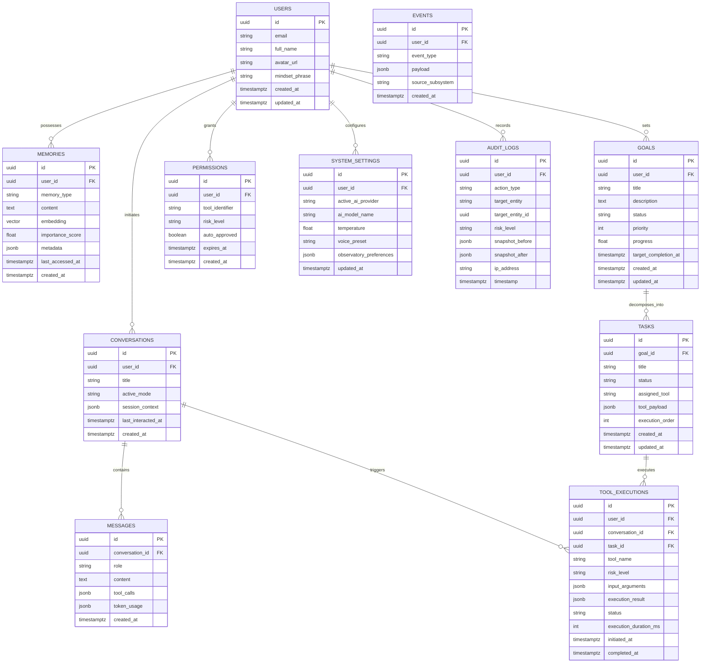

# DHAVON — Database Schema & Data Architecture
**Supabase PostgreSQL (RLS, pgvector, Realtime)**
*Normalized Relational Schema, Vector Embeddings, Security Policies*

---

## 1. Schema Design Principles

The DHAVON database is built on Supabase PostgreSQL with the following core tenets:
1. **Strict Normalization**: Tables model fundamental cognitive concepts without redundancy.
2. **UUID Primary Keys**: Every table uses cryptographic `uuid_generate_v4()` or `gen_random_uuid()` for distributed safety.
3. **Auditability**: Every mutation tracks `created_at` and `updated_at` via automated triggers.
4. **Vector Memory Integration**: Native `pgvector` extension for semantic memory similarity search.
5. **Zero-Trust Security with RLS**: All tables have Row Level Security enabled; users can only query and mutate their own data via `auth.uid()`.

---

## 2. Entity Relationship Diagram (ERD)



---

## 3. SQL Table Definitions & Constraints

```sql
-- Enable necessary PostgreSQL extensions
CREATE EXTENSION IF NOT EXISTS "uuid-ossp";
CREATE EXTENSION IF NOT EXISTS "vector";

-- 1. USERS (Extends Supabase auth.users)
CREATE TABLE public.users (
    id UUID PRIMARY KEY REFERENCES auth.users(id) ON DELETE CASCADE,
    email TEXT NOT NULL UNIQUE,
    full_name TEXT NOT NULL,
    avatar_url TEXT,
    mindset_phrase TEXT DEFAULT 'Powered by Your Mindset',
    created_at TIMESTAMPTZ NOT NULL DEFAULT timezone('utc'::text, now()),
    updated_at TIMESTAMPTZ NOT NULL DEFAULT timezone('utc'::text, now())
);

-- 2. CONVERSATIONS
CREATE TABLE public.conversations (
    id UUID PRIMARY KEY DEFAULT gen_random_uuid(),
    user_id UUID NOT NULL REFERENCES public.users(id) ON DELETE CASCADE,
    title TEXT NOT NULL DEFAULT 'Observatory Session',
    active_mode TEXT NOT NULL DEFAULT 'ask' CHECK (active_mode IN ('ask', 'plan', 'create', 'analyze')),
    session_context JSONB NOT NULL DEFAULT '{}'::jsonb,
    last_interacted_at TIMESTAMPTZ NOT NULL DEFAULT timezone('utc'::text, now()),
    created_at TIMESTAMPTZ NOT NULL DEFAULT timezone('utc'::text, now())
);
CREATE INDEX idx_conversations_user_id ON public.conversations(user_id);
CREATE INDEX idx_conversations_last_interacted ON public.conversations(last_interacted_at DESC);

-- 3. MESSAGES
CREATE TABLE public.messages (
    id UUID PRIMARY KEY DEFAULT gen_random_uuid(),
    conversation_id UUID NOT NULL REFERENCES public.conversations(id) ON DELETE CASCADE,
    role TEXT NOT NULL CHECK (role IN ('user', 'assistant', 'system', 'tool')),
    content TEXT NOT NULL,
    tool_calls JSONB,
    token_usage JSONB DEFAULT '{"prompt_tokens": 0, "completion_tokens": 0, "total_tokens": 0}'::jsonb,
    created_at TIMESTAMPTZ NOT NULL DEFAULT timezone('utc'::text, now())
);
CREATE INDEX idx_messages_conversation_id ON public.messages(conversation_id);
CREATE INDEX idx_messages_created_at ON public.messages(created_at ASC);

-- 4. MEMORIES (Episodic, Semantic, Working, Preferences)
CREATE TABLE public.memories (
    id UUID PRIMARY KEY DEFAULT gen_random_uuid(),
    user_id UUID NOT NULL REFERENCES public.users(id) ON DELETE CASCADE,
    memory_type TEXT NOT NULL CHECK (memory_type IN ('episodic', 'semantic', 'working', 'preference')),
    content TEXT NOT NULL,
    embedding VECTOR(1536), -- Standard embedding dimension (e.g. OpenAI / Gemini text-embedding-004)
    importance_score FLOAT NOT NULL DEFAULT 0.5 CHECK (importance_score >= 0.0 AND importance_score <= 1.0),
    metadata JSONB NOT NULL DEFAULT '{}'::jsonb,
    last_accessed_at TIMESTAMPTZ DEFAULT timezone('utc'::text, now()),
    created_at TIMESTAMPTZ NOT NULL DEFAULT timezone('utc'::text, now())
);
CREATE INDEX idx_memories_user_id ON public.memories(user_id);
CREATE INDEX idx_memories_type ON public.memories(memory_type);
-- HNSW vector similarity index for fast semantic lookup
CREATE INDEX idx_memories_embedding ON public.memories USING hnsw (embedding vector_cosine_ops);

-- 5. GOALS
CREATE TABLE public.goals (
    id UUID PRIMARY KEY DEFAULT gen_random_uuid(),
    user_id UUID NOT NULL REFERENCES public.users(id) ON DELETE CASCADE,
    title TEXT NOT NULL,
    description TEXT,
    status TEXT NOT NULL DEFAULT 'active' CHECK (status IN ('active', 'paused', 'achieved', 'abandoned')),
    priority INT NOT NULL DEFAULT 1 CHECK (priority BETWEEN 1 AND 5),
    progress FLOAT NOT NULL DEFAULT 0.0 CHECK (progress >= 0.0 AND progress <= 100.0),
    target_completion_at TIMESTAMPTZ,
    created_at TIMESTAMPTZ NOT NULL DEFAULT timezone('utc'::text, now()),
    updated_at TIMESTAMPTZ NOT NULL DEFAULT timezone('utc'::text, now())
);
CREATE INDEX idx_goals_user_id ON public.goals(user_id);
CREATE INDEX idx_goals_status ON public.goals(status);

-- 6. TASKS (Goal sub-steps)
CREATE TABLE public.tasks (
    id UUID PRIMARY KEY DEFAULT gen_random_uuid(),
    goal_id UUID NOT NULL REFERENCES public.goals(id) ON DELETE CASCADE,
    title TEXT NOT NULL,
    status TEXT NOT NULL DEFAULT 'pending' CHECK (status IN ('pending', 'in_progress', 'completed', 'failed', 'blocked')),
    assigned_tool TEXT,
    tool_payload JSONB DEFAULT '{}'::jsonb,
    execution_order INT NOT NULL DEFAULT 1,
    created_at TIMESTAMPTZ NOT NULL DEFAULT timezone('utc'::text, now()),
    updated_at TIMESTAMPTZ NOT NULL DEFAULT timezone('utc'::text, now())
);
CREATE INDEX idx_tasks_goal_id ON public.tasks(goal_id);
CREATE INDEX idx_tasks_status ON public.tasks(status);

-- 7. TOOL_EXECUTIONS (Execution log & telemetry)
CREATE TABLE public.tool_executions (
    id UUID PRIMARY KEY DEFAULT gen_random_uuid(),
    user_id UUID NOT NULL REFERENCES public.users(id) ON DELETE CASCADE,
    conversation_id UUID REFERENCES public.conversations(id) ON DELETE SET NULL,
    task_id UUID REFERENCES public.tasks(id) ON DELETE SET NULL,
    tool_name TEXT NOT NULL,
    risk_level TEXT NOT NULL CHECK (risk_level IN ('READ', 'LOW_RISK', 'CONFIRMATION_REQUIRED', 'SENSITIVE')),
    input_arguments JSONB NOT NULL,
    execution_result JSONB,
    status TEXT NOT NULL CHECK (status IN ('pending', 'approved', 'rejected', 'running', 'completed', 'failed', 'timed_out')),
    execution_duration_ms INT,
    initiated_at TIMESTAMPTZ NOT NULL DEFAULT timezone('utc'::text, now()),
    completed_at TIMESTAMPTZ
);
CREATE INDEX idx_tool_executions_user ON public.tool_executions(user_id);
CREATE INDEX idx_tool_executions_status ON public.tool_executions(status);

-- 8. PERMISSIONS (Tool security authorizations)
CREATE TABLE public.permissions (
    id UUID PRIMARY KEY DEFAULT gen_random_uuid(),
    user_id UUID NOT NULL REFERENCES public.users(id) ON DELETE CASCADE,
    tool_identifier TEXT NOT NULL,
    risk_level TEXT NOT NULL CHECK (risk_level IN ('READ', 'LOW_RISK', 'CONFIRMATION_REQUIRED', 'SENSITIVE')),
    auto_approved BOOLEAN NOT NULL DEFAULT false,
    expires_at TIMESTAMPTZ,
    created_at TIMESTAMPTZ NOT NULL DEFAULT timezone('utc'::text, now()),
    UNIQUE(user_id, tool_identifier)
);

-- 9. EVENTS (Telemetry stream)
CREATE TABLE public.events (
    id UUID PRIMARY KEY DEFAULT gen_random_uuid(),
    user_id UUID NOT NULL REFERENCES public.users(id) ON DELETE CASCADE,
    event_type TEXT NOT NULL,
    payload JSONB NOT NULL DEFAULT '{}'::jsonb,
    source_subsystem TEXT NOT NULL,
    created_at TIMESTAMPTZ NOT NULL DEFAULT timezone('utc'::text, now())
);
CREATE INDEX idx_events_user_time ON public.events(user_id, created_at DESC);

-- 10. SYSTEM_SETTINGS
CREATE TABLE public.system_settings (
    id UUID PRIMARY KEY DEFAULT gen_random_uuid(),
    user_id UUID NOT NULL REFERENCES public.users(id) ON DELETE CASCADE UNIQUE,
    active_ai_provider TEXT NOT NULL DEFAULT 'gemini',
    ai_model_name TEXT NOT NULL DEFAULT 'gemini-1.5-pro',
    temperature FLOAT NOT NULL DEFAULT 0.7 CHECK (temperature >= 0.0 AND temperature <= 2.0),
    voice_preset TEXT NOT NULL DEFAULT 'aura-starlight',
    observatory_preferences JSONB NOT NULL DEFAULT '{
        "orb_intensity": 1.0,
        "particle_density": 1.0,
        "sound_effects_enabled": true,
        "ambient_lighting": "cinematic"
    }'::jsonb,
    updated_at TIMESTAMPTZ NOT NULL DEFAULT timezone('utc'::text, now())
);

-- 11. AUDIT_LOGS (Immutable tamper-proof log)
CREATE TABLE public.audit_logs (
    id UUID PRIMARY KEY DEFAULT gen_random_uuid(),
    user_id UUID NOT NULL REFERENCES public.users(id) ON DELETE CASCADE,
    action_type TEXT NOT NULL,
    target_entity TEXT NOT NULL,
    target_entity_id UUID,
    risk_level TEXT NOT NULL,
    snapshot_before JSONB,
    snapshot_after JSONB,
    ip_address TEXT,
    timestamp TIMESTAMPTZ NOT NULL DEFAULT timezone('utc'::text, now())
);
CREATE INDEX idx_audit_logs_user_timestamp ON public.audit_logs(user_id, timestamp DESC);
```

---

## 4. Row Level Security (RLS) Policies

All tables mandate RLS to guarantee data isolation:

```sql
-- Enable RLS on all tables
ALTER TABLE public.users ENABLE ROW LEVEL SECURITY;
ALTER TABLE public.conversations ENABLE ROW LEVEL SECURITY;
ALTER TABLE public.messages ENABLE ROW LEVEL SECURITY;
ALTER TABLE public.memories ENABLE ROW LEVEL SECURITY;
ALTER TABLE public.goals ENABLE ROW LEVEL SECURITY;
ALTER TABLE public.tasks ENABLE ROW LEVEL SECURITY;
ALTER TABLE public.tool_executions ENABLE ROW LEVEL SECURITY;
ALTER TABLE public.permissions ENABLE ROW LEVEL SECURITY;
ALTER TABLE public.events ENABLE ROW LEVEL SECURITY;
ALTER TABLE public.system_settings ENABLE ROW LEVEL SECURITY;
ALTER TABLE public.audit_logs ENABLE ROW LEVEL SECURITY;

-- Standard Policy: Users can only select, insert, update their own rows
CREATE POLICY users_isolation ON public.users FOR ALL USING (auth.uid() = id);

CREATE POLICY conversations_isolation ON public.conversations FOR ALL USING (auth.uid() = user_id);

CREATE POLICY messages_isolation ON public.messages FOR ALL USING (
    EXISTS (SELECT 1 FROM public.conversations WHERE id = messages.conversation_id AND user_id = auth.uid())
);

CREATE POLICY memories_isolation ON public.memories FOR ALL USING (auth.uid() = user_id);

CREATE POLICY goals_isolation ON public.goals FOR ALL USING (auth.uid() = user_id);

CREATE POLICY tasks_isolation ON public.tasks FOR ALL USING (
    EXISTS (SELECT 1 FROM public.goals WHERE id = tasks.goal_id AND user_id = auth.uid())
);

CREATE POLICY tool_executions_isolation ON public.tool_executions FOR ALL USING (auth.uid() = user_id);

CREATE POLICY permissions_isolation ON public.permissions FOR ALL USING (auth.uid() = user_id);

CREATE POLICY events_isolation ON public.events FOR ALL USING (auth.uid() = user_id);

CREATE POLICY settings_isolation ON public.system_settings FOR ALL USING (auth.uid() = user_id);

-- Audit logs: Users can view their audit trail, only system can insert
CREATE POLICY audit_logs_read_only ON public.audit_logs FOR SELECT USING (auth.uid() = user_id);
```

---

## 5. Semantic Memory Vector Search Function

```sql
CREATE OR REPLACE FUNCTION match_memories (
  query_embedding VECTOR(1536),
  match_threshold FLOAT,
  match_count INT,
  filter_user_id UUID
)
RETURNS TABLE (
  id UUID,
  content TEXT,
  memory_type TEXT,
  importance_score FLOAT,
  similarity FLOAT
)
LANGUAGE plpgsql
SECURITY DEFINER
AS $$
BEGIN
  RETURN QUERY
  SELECT
    m.id,
    m.content,
    m.memory_type,
    m.importance_score,
    1 - (m.embedding <=> query_embedding) AS similarity
  FROM public.memories m
  WHERE m.user_id = filter_user_id
    AND 1 - (m.embedding <=> query_embedding) > match_threshold
  ORDER BY similarity DESC
  LIMIT match_count;
END;
$$;
```

---

## 6. Environment Configuration Structure

```env
# Client-accessible public variables (apps/web/.env.local)
NEXT_PUBLIC_SUPABASE_URL=https://your-project.supabase.co
NEXT_PUBLIC_SUPABASE_ANON_KEY=your-public-anon-key
NEXT_PUBLIC_API_URL=http://localhost:4000
NEXT_PUBLIC_WS_URL=ws://localhost:4000

# Backend private secrets (apps/api/.env)
NODE_ENV=development
PORT=4000
SUPABASE_URL=https://your-project.supabase.co
SUPABASE_SERVICE_ROLE_KEY=your-private-service-role-key
SUPABASE_JWT_SECRET=your-jwt-secret

# AI Provider Credentials
AI_DEFAULT_PROVIDER=gemini
GEMINI_API_KEY=your-gemini-key
ANTHROPIC_API_KEY=your-anthropic-key
OPENAI_API_KEY=your-openai-key

# Security & CORS
CORS_ORIGINS=http://localhost:3000
TOKEN_ENCRYPTION_KEY=32-character-secret-key-for-credentials
```
